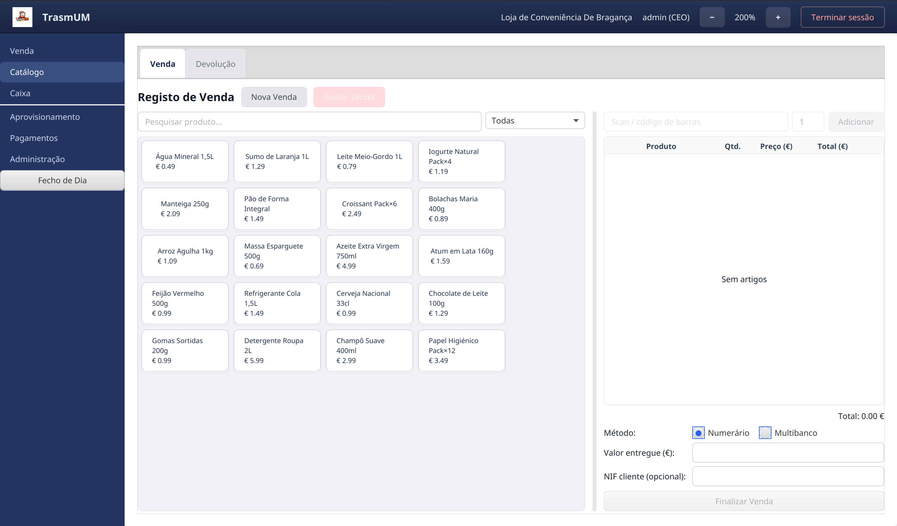
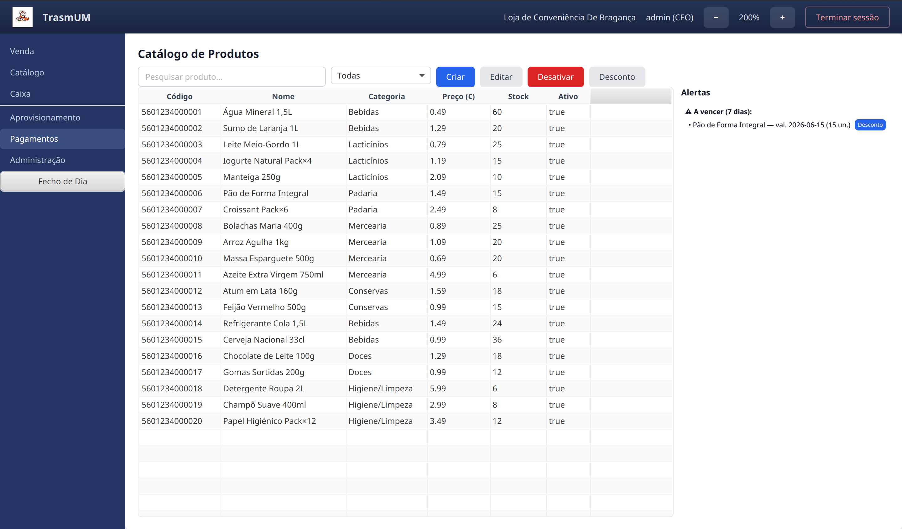
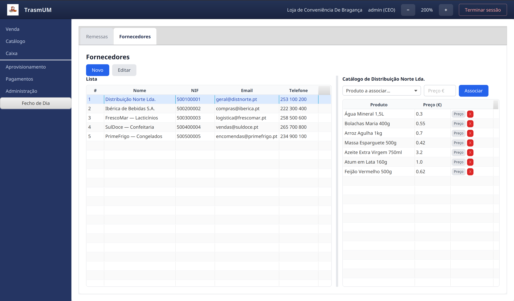
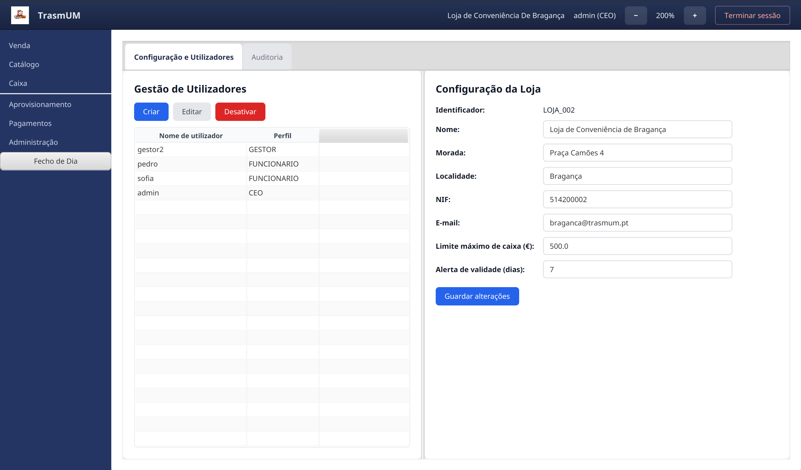
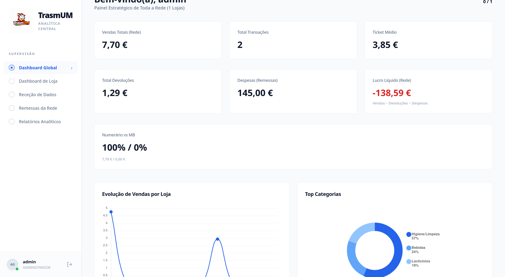
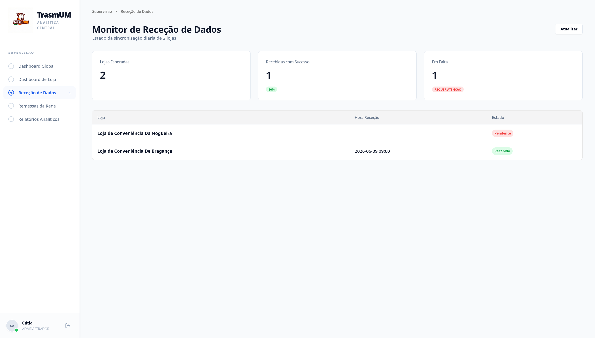
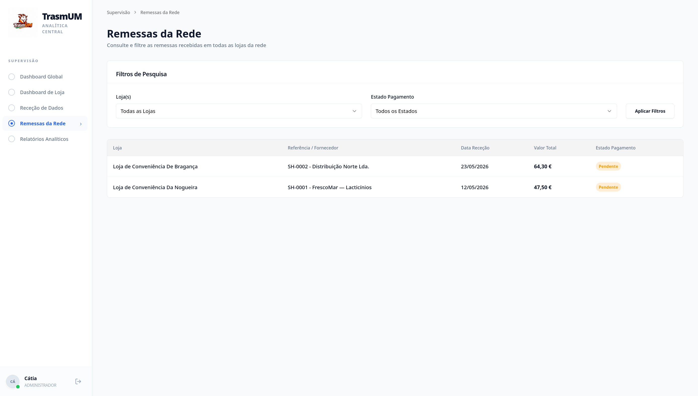
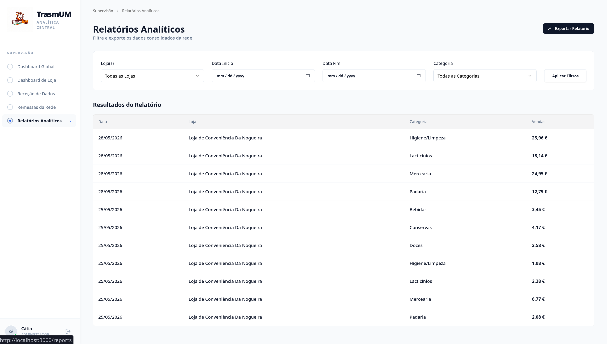

# TrasmUM — Convenience Store Chain Management System

System composed of two distinct software components that communicate with each other via HTTP:

- **`loja/`** — point-of-sale terminal in JavaFX (Java 21 + Maven + MySQL `trasmum_loja`). Runs on each physical store terminal.
- **`servidor_central/backend/`** — central server in Javalin (Java 21 + Maven + MySQL `trasmum_servidor`). Listens on port `:8080` and receives end-of-day packages from each Store.
- **`servidor_central/frontend/`** — monitoring and management dashboard in Vue 3 + Vite. Communicates with the backend via HTTP.

The SQL schemas are located at `loja/src/main/resources/schema.sql` and `servidor_central/backend/db/schema.sql`.

## Store Software

<table align="center">
  <tr>
    <td align="center">
      
      <br/>
      <em>Point of Sale (POS) Panel</em>
    </td>
    <td align="center">
      
      <br/>
      <em>Product Catalog Panel</em>
    </td>
  </tr>
</table>

<table align="center">
  <tr>
    <td align="center">
      
      <br/>
      <em>Supplier Management Panel</em>
    </td>
    <td align="center">
      
      <br/>
      <em>Administration Panel</em>
    </td>
  </tr>
</table>

## Central Server Software

<table align="center">
  <tr>
    <td align="center">
      
      <br/>
      <em>Global Dashboard Panel</em>
    </td>
    <td align="center">
      
      <br/>
      <em>Receipt Monitoring Panel</em>
    </td>
  </tr>
</table>
<table align="center">
  <tr>
    <td align="center">
      
      <br/>
      <em>Network Shipments Panel</em>
    </td>
    <td align="center">
      
      <br/>
      <em>Sales Reports Panel</em>
    </td>
  </tr>
</table>

## Grade

**Final Grade:** 18 / 20 ⭐

## Authors

- *Simão Oliveira* -> [@SimaoOliveira05](https://github.com/SimaoOliveira05)
- *Gabriel Dantas* -> [@gabil88](https://github.com/gabil88)
- *José Fernandes* -> [@JoseLourencoFernandes](https://github.com/JoseLourencoFernandes)
- *Luís Ferreira* -> [@1Plus0NE](https://github.com/1Plus0NE)

---

## Prerequisites

| Component | Minimum Version | Purpose | Mode |
|---|---|---|---|
| Java (JDK) | 21 LTS | Run the Store Software and the local backend | Both |
| Maven | 3.9 | Compile and run the Java projects | Both |
| MySQL | 8.0 | Local database (without Docker) | Local |
| Node.js | 20 LTS | Compile and run the frontend without Docker | Local |
| Docker | 24.0 | Orchestrate the Central Server services | Docker |
| Docker Compose | 2.20 | Orchestrate the Central Server services | Docker |

---

## Installation and Start via Docker Compose (recommended for the Central Server)

Requires Docker and Docker Compose installed and ports 3307, 8080, and 3000 available.

```bash
# 1. Navigate to the Central Server directory
cd servidor_central

# 2. Create the environment configuration file from the template
cp .env.example .env
# Edit .env if necessary (see Configuration section)

# 3. Build and start the services (MySQL + backend + frontend)
docker compose up --build
```

The frontend is available at `http://localhost:3000` and the backend at `http://localhost:8080`.

```bash
# Stop without removing data
docker compose down

# Stop and remove volumes (deletes all central database data)
docker compose down -v
```

---

## Local Installation and Start (without Docker)

### 1. Database Setup

Create the MySQL user and grant permissions:

```sql
CREATE USER 'trasmum'@'localhost' IDENTIFIED BY 'trasmum';
GRANT ALL PRIVILEGES ON trasmum_loja.*     TO 'trasmum'@'localhost';
GRANT ALL PRIVILEGES ON trasmum_servidor.* TO 'trasmum'@'localhost';
FLUSH PRIVILEGES;
```

### 2. Starting the Central Server

```bash
cd servidor_central/backend  && mvn compile && mvn exec:java
cd servidor_central/frontend && npm install && npm run dev
```

### 3. Starting the Store Software

```bash
cd loja && mvn javafx:run
```

**Correct startup sequence:** database → backend → frontend → Store Software.

The Store Software can operate in sales mode without a connection to the server; the connection is only required at the moment of the end-of-day close.

---

## Configuration

### Store Software

File: `loja/src/main/resources/config.properties`

| Parameter | Description | Default Value |
|---|---|---|
| `loja.id` | Unique store identifier (included in all end-of-day packages) | `LOJA_002` |
| `loja.nome` | Store trade name (appears on invoices) | — |
| `loja.morada` | Store address (appears on invoices) | — |
| `loja.localidade` | Store locality (appears on invoices) | — |
| `loja.nif` | Store VAT number (appears on invoices) | — |
| `loja.email` | Contact email address | — |
| `loja.limiteMaximoCaixa` | Maximum cash limit in the till (euros) | `500.00` |
| `servidor.url` | Base URL of the Central Server backend | `http://localhost:8080` |
| `servidor.alertaValidade.dias` | Days in advance for expiry alerts | `7` |
| `db.url` | Connection URL to the local Store database | MySQL at `localhost:3306` |
| `db.user` | Local database user | `trasmum` |
| `db.password` | Local database password | `trasmum` |

Each store instance must have a unique `loja.id` within the chain.

### Central Server Software

**Via Docker:** edit `servidor_central/.env` (use `servidor_central/.env.example` as a template).

**Via local execution:** edit `servidor_central/backend/src/main/resources/config.properties`.

Environment variables always override values in the configuration file.

| Parameter / Environment Variable | Description | Default Value |
|---|---|---|
| `db.url` / `DB_URL` | Connection URL to the central database | MySQL at `localhost:3306` |
| `db.user` / `DB_USER` | Central database user | `trasmum` |
| `db.password` / `DB_PASSWORD` | Central database password | `trasmum` |
| `frontend.origem` / `FRONTEND_ORIGEM` | Allowed origin for frontend CORS requests | `http://localhost:5173` |
| `servidor.porta` / `SERVER_PORT` | Backend listening port | `8080` |
| `VITE_API_URL` | Backend URL visible to the browser (injected at build time) | `http://localhost:8080` |
| `db.retry.maxTentativas` / `DB_RETRY_MAX_TENTATIVAS` | Maximum number of DB connection attempts at startup | `10` |
| `db.retry.delayMs` / `DB_RETRY_DELAY_MS` | Interval between DB connection attempts (ms) | `2000` |

---

## Credentials and First Access

Both software components automatically create, on first startup, an administration account with credentials **`admin` / `admin123`**. This account is deleted as soon as a user with a different username successfully logs in for the first time.

**Recommendation:** after the initial setup, immediately create a permanent account with a secure password and perform the first login with that account.

---

## Daily Operation

### Daily Cycle

1. The manager authenticates on the Store terminal with a Manager or CEO profile.
2. Accesses the end-of-day menu and starts the process.
3. The system aggregates the day's transactions into a package, calculates the SHA-256 hash and sends it to `<servidor.url>/fecho`.
4. The Central Server validates the hash, persists the data and returns confirmation.
5. The terminal updates the transaction status to _confirmed_.

The end-of-day package can be resent if the connection is unavailable at the time of closing.

### Monitoring

The dashboard (`http://localhost:3000` via Docker or `http://localhost:5173` in local development) provides a global view of sales, synchronisation status of each store, shipment management, and reports by category and period.

---

## Maintenance

### Backup

```bash
# Store database
mysqldump -u trasmum -ptrasmum trasmum_loja > backup_loja_$(date +%Y%m%d).sql

# Central Server database (local execution)
mysqldump -u trasmum -ptrasmum trasmum_servidor > backup_servidor_$(date +%Y%m%d).sql

# Central Server database (via Docker, with services running)
docker exec mysql_data mysqldump -u trasmum -ptrasmum trasmum_servidor \
  > backup_servidor_$(date +%Y%m%d).sql
```

### Restore

```bash
mysql -u trasmum -ptrasmum trasmum_loja     < backup_loja_YYYYMMDD.sql
mysql -u trasmum -ptrasmum trasmum_servidor < backup_servidor_YYYYMMDD.sql
```

### Update

```bash
git pull

# Via Docker — rebuilds and replaces containers
cd servidor_central && docker compose up --build

# Local execution
cd servidor_central/backend  && mvn compile
cd servidor_central/frontend && npm install && npm run build
cd loja                      && mvn clean package
```

### Tests

```bash
# Store Software (4 classes: Autorizacao, Devolucao, FechoDia, Venda)
cd loja && mvn test

# Central Server Backend (2 classes: AutenticacaoCEO, Ingestao)
cd servidor_central/backend && mvn test

# Individual class
mvn test -Dtest=ClassName

# Individual method
mvn test -Dtest=ClassName#methodName
```

The frontend has no automated tests.

---

## Troubleshooting

| Symptom | Likely Cause | Solution |
|---|---|---|
| Backend won't start: `Config obrigatória em falta: db.url` | `config.properties` missing DB values and no environment variables set | Check `.env` (Docker) or `config.properties` (local) |
| Backend won't start: `Port already in use: 8080` | Another instance or container already using the port | Terminate the conflicting process or stop the Docker container |
| End-of-day close fails: `Connection refused` | Backend not reachable at the address in `servidor.url` | Verify the backend is running and `servidor.url` is correct |
| End-of-day close fails: `Hash inválido` | Data corruption during transmission | Retry the close; if it persists, check the integrity of the local Store database |
| Store Software won't start: DB connection error | MySQL is not running or incorrect credentials | Verify MySQL is active and the `db.*` parameters in `config.properties` |
| Dashboard shows no data after confirmed close | Frontend pointing to incorrect backend URL | Check `VITE_API_URL` in `.env` and rebuild with `docker compose up --build` |